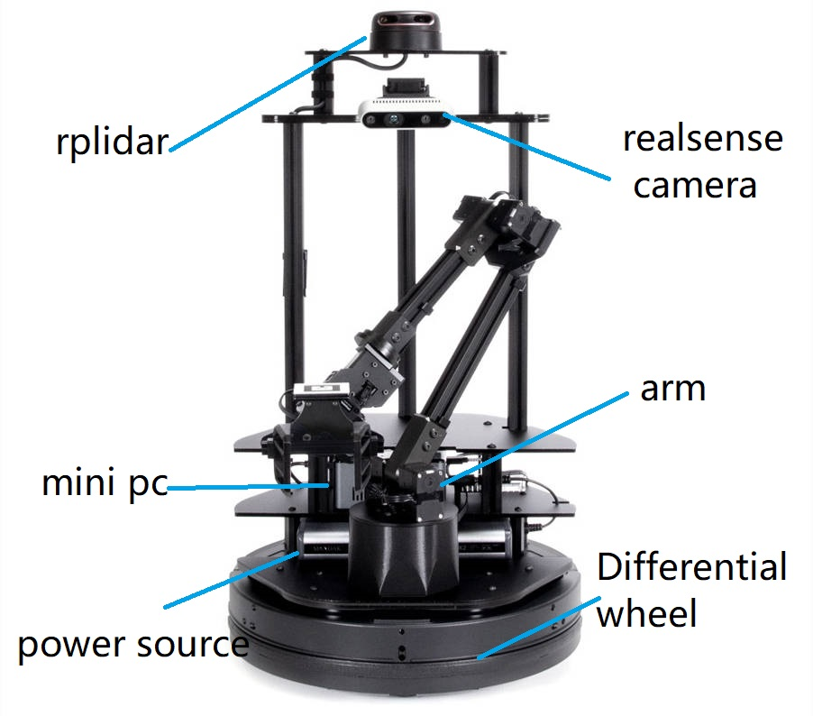
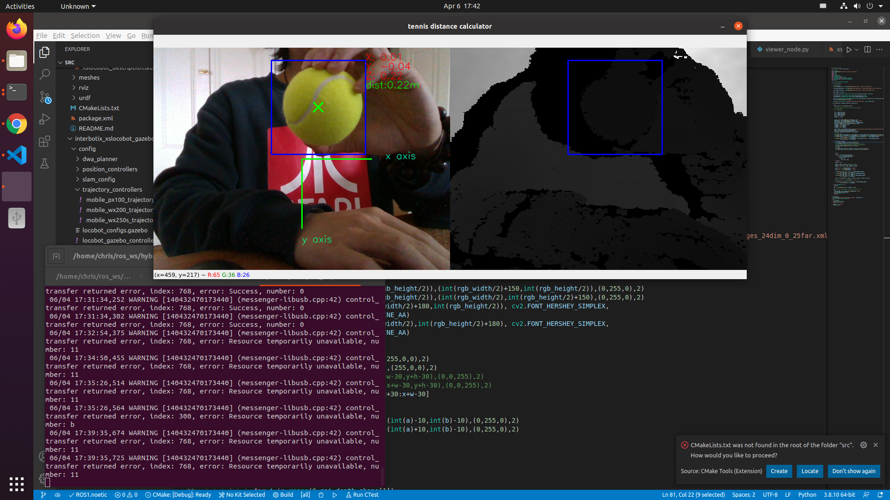

### Introduction

Robotic project: A robot that autonomously picks up tennis balls. Northeastern University

This is the final project of CS5335 Robotics System and Science.

In this project, we aim to design a robot with SLAM, navigation, visual computing, robotic arm grasping functions to help us pick up tennis balls automatically.

In this project, we develop in simulation and physical robot respectively.

The type of robot used in this project is the locobot WX250s, which is a hybrid type robot.

https://www.trossenrobotics.com/locobot-wx250-6-degree-of-freedom.aspx#documentation

Currently this part of the code belongs to the simulation part.

Code for the simulation: https://github.com/Yandong-Luo/hybrid

### Result

#### SLAM

We mapped some areas of the laboratory, and the effects are as follows. The content about this part can be found at this link: https://youtu.be/Ln7m51FUzJE

#### Navigation

#### CV

I trained the recognition of tennis balls based on the cascade classifier, and combined with the camera matrix, I calculated the position of the tennis balls relative to the camera. For details, see tennis_ball_distance_calculator

#### Pick up Task

The robot first recognizes the tennis ball through the camera and calculates its distance, and converts it into the coordinate system of the robotic arm, so that the robotic arm can accurately grasp the tennis ball. Unfortunately, the surface of the gripper is too slippery and its size is too small compared to the tennis ball, so the robotic arm cannot grasp the tennis ball smoothly. But simply by redesigning the grips, the tennis ball can be successfully picked up.

